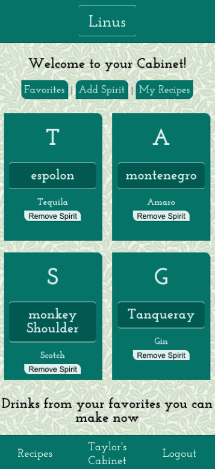

Linus
=====
[Live](https://linus-ten.now.sh/)

Summary
-------
Linus is a personal bartender for your home. With Linus you can add your favorite and current spirits in your liquor cabinet to your digital cabinet, and Linus will show you what cocktails you can make with your spirits and how! You will also be able to search for recipes by spirit type and make a shortlist of your favorite ones to try later.

### Your Cabinet
Once Logged in you'll be sent your Cabinet, this is where you'll add and store your Spirits. From here you can access your entire favorite recipes list, as well as a shortlist below where it shows you which favorites you can make based off of the spirits currently in your cabinet.

### Searching for Recipes
Once you add some Spirits to your cabinet it's time to look for some recipes to make! The recipes page can search by name of recipe, or spirit type, displaying all the cocktails in the database that fir the parameters. 

 

After finding a recipe you would like, you can follow the instructions to buyild it, or save it ti your favorites to make later.

### Viewing Favorites
If there is a cocktail that you enjoyed, and want to make it more often, then save it to your favorites! Linus will remind you that you can make it when you have the main Spirit in your cabinet. To take a look at all of your favorites there is a link towards the top of the Cabinet that leads you to the favorites page. Within the favorites page you can search through your favorites wtih the same parameters you used to serach for other recipes, by spirit or name.

Technology Used
---------------
+ React
+ Express
+ CSS3
+ Javascript

API
---

[Link](https://github.com/thinkful-ei-jaguar/TaylorP-firstCapstone-server) to API GitHub

DEMO Account
------

Username: dunder

password: password2